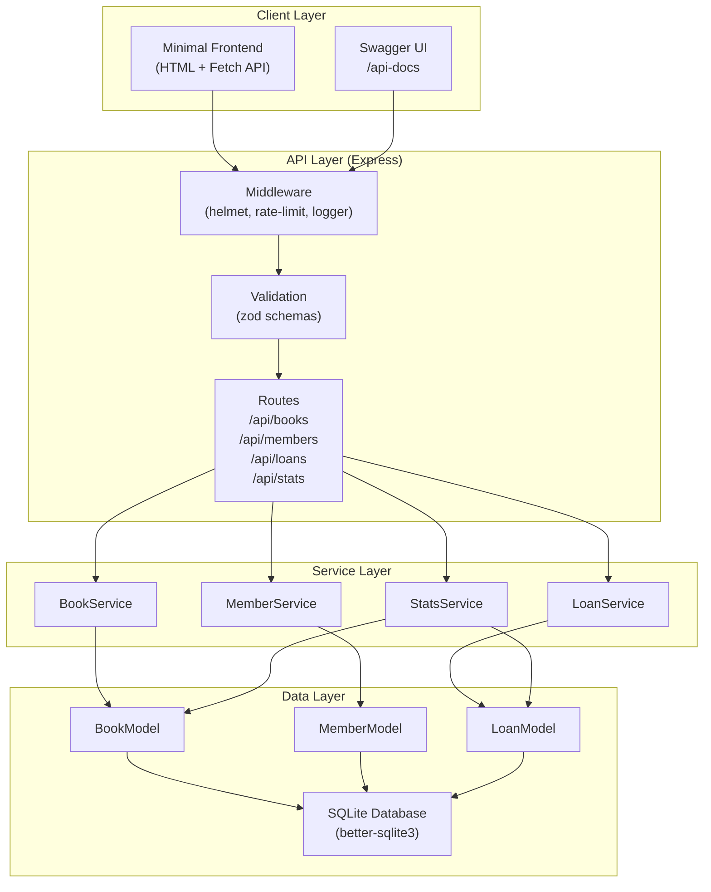
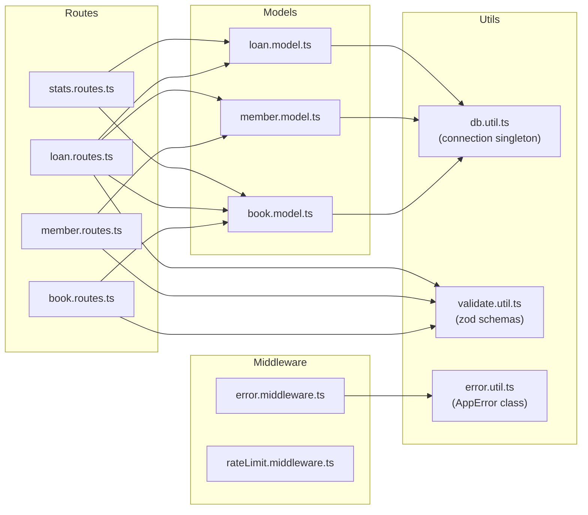
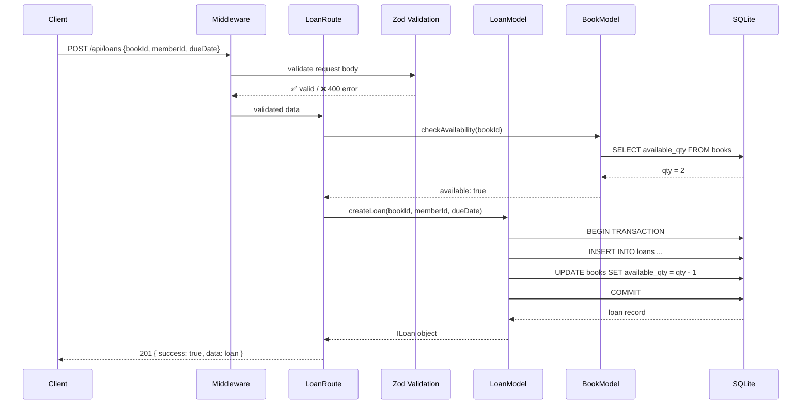
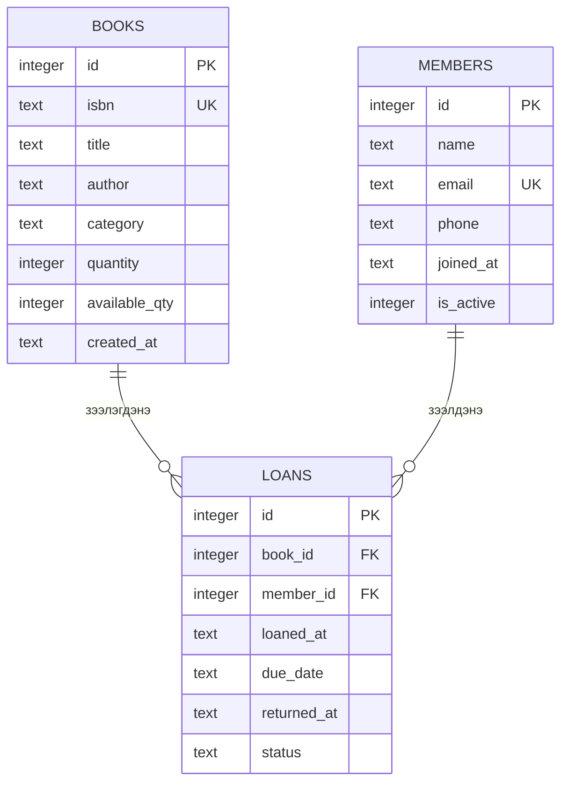

# ARCHITECTURE.md — Mini Library System

## Системийн архитектур

### Давхарга (Layer) диаграм



### Модулийн харилцаа



### Data Flow — Ном зээлэх



### Database схем



## Модулийн тайлбар

| Модуль | Файл | Үүрэг |
|--------|------|-------|
| App entry | `src/app.ts` | Express app тохиргоо, middleware бүртгэл |
| Server | `src/server.ts` | HTTP server эхлүүлэх, graceful shutdown |
| DB Util | `src/utils/db.util.ts` | SQLite connection singleton, migration |
| Book Model | `src/models/book.model.ts` | CRUD + хайлт + availability |
| Member Model | `src/models/member.model.ts` | CRUD + идэвхжүүлэх/идэвхгүй болгох |
| Loan Model | `src/models/loan.model.ts` | Зээл үүсгэх, буцаах, хугацаа шалгах |
| Validation | `src/utils/validate.util.ts` | Zod schema-нууд |
| Error handler | `src/middleware/error.middleware.ts` | Глобал алдаа барих |
| Rate limiter | `src/middleware/rateLimit.middleware.ts` | express-rate-limit |

## Deployment

```
[Developer] → git push → GitHub
                              ↓
                     [Server: Ubuntu 22]
                     node dist/server.js
                     Port 3000
                     library.db (local file)
```
